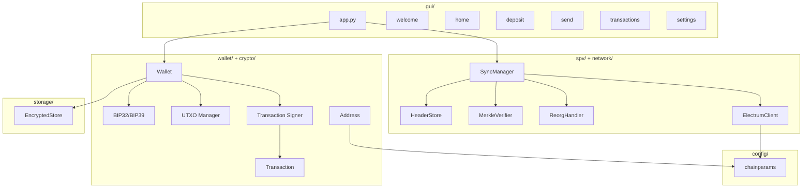
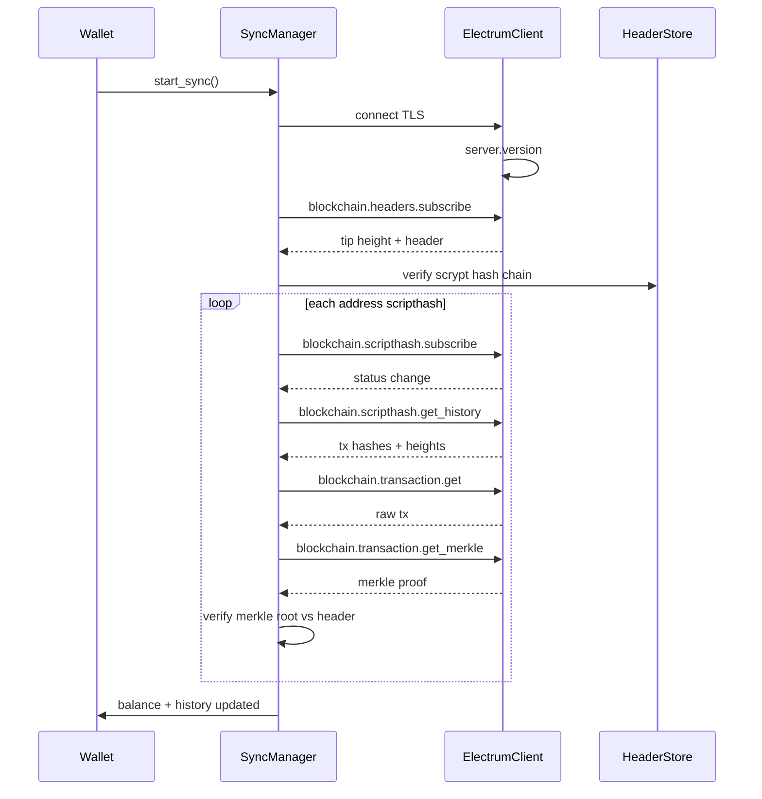
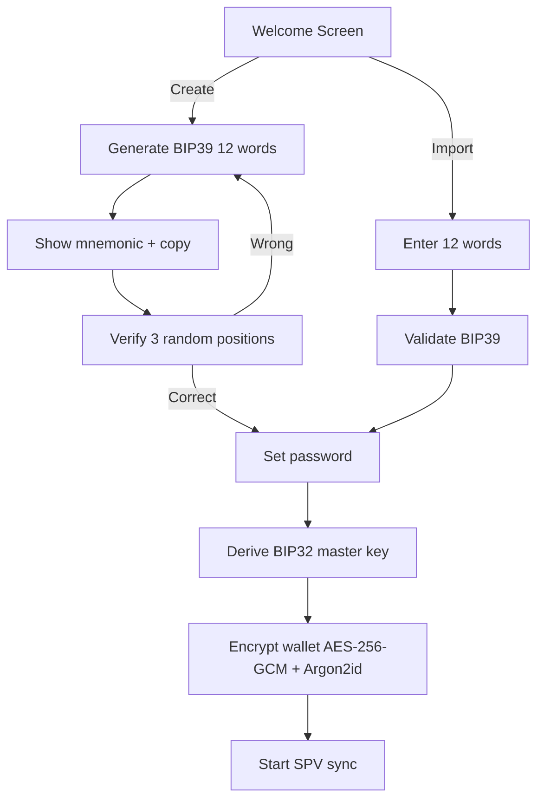
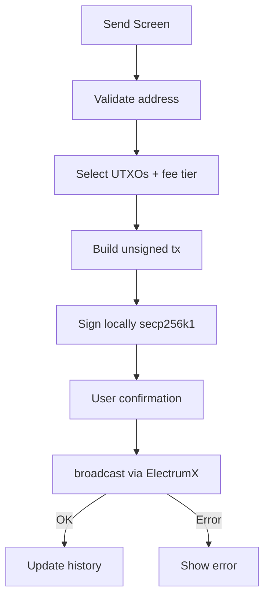

# InfiniteRicks SPV Wallet — Architecture

## Overview

Lightweight Android/desktop wallet for InfiniteRicks (RICK). Uses SPV synchronization via ElectrumX-compatible servers. Private keys never leave the device.

**Not a fork of Electrum.** Original modular Python architecture reusing only SPV concepts.

## Module Diagram



## SPV Sync Flow



## Wallet Creation Flow



## Transaction Send Flow



## Folder Structure

```
infinitericks_wallet/
├── config/          # Chain parameters (from official repo)
├── crypto/          # Hash, scrypt, keys, addresses, transactions
├── wallet/          # BIP39/32, UTXO, signing, fees
├── network/         # ElectrumX JSON-RPC over TLS
├── spv/             # Header sync, merkle proofs, reorg
├── gui/             # PySide6 screens
├── storage/         # Encrypted wallet persistence
├── android/         # APK build (pyside6-android-deploy)
├── resources/       # Icons, QSS styles
├── tests/           # pytest suite
├── scripts/         # Build & utility scripts
└── docs/            # Documentation
```

## Security Model

| Layer | Technology |
|-------|------------|
| Wallet file encryption | AES-256-GCM |
| Key derivation | Argon2id (64 MiB, 3 iterations) |
| Seed | BIP39 12 words, never transmitted |
| Signing | secp256k1 ECDSA, local only |
| Network | TLS to ElectrumX server |

## Network Server

Primary: `144.91.107.244:50002` (SSL). Failover list extensible in `config/chainparams.py`.

## Parameters Source

All chain parameters extracted from [2x2devcode/InfiniteRicks](https://github.com/2x2devcode/InfiniteRicks). See `docs/CHAIN_ANALYSIS.md`.

## Missing Official Parameters

- **BIP44 coin type**: Not defined in official repository. Configurable via `BIP44_COIN_TYPE` in chainparams (default documented as user-configurable).
